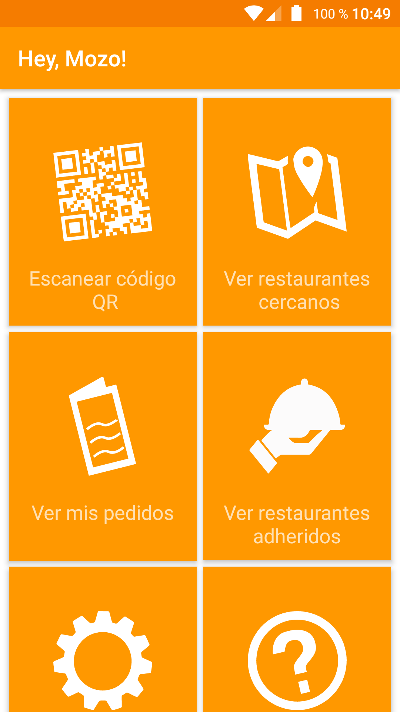
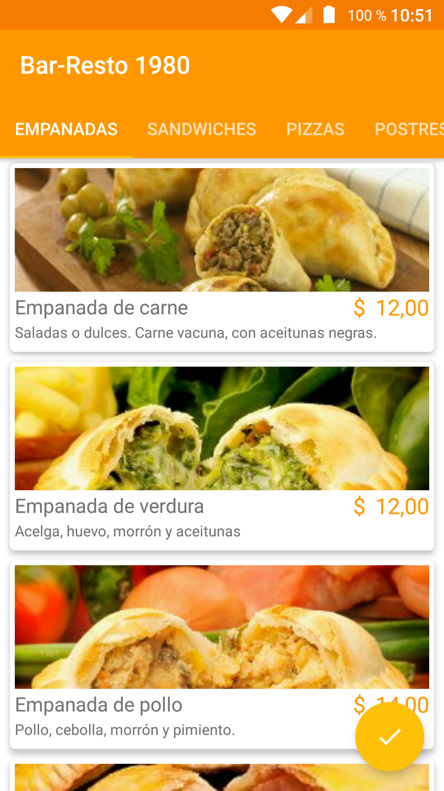
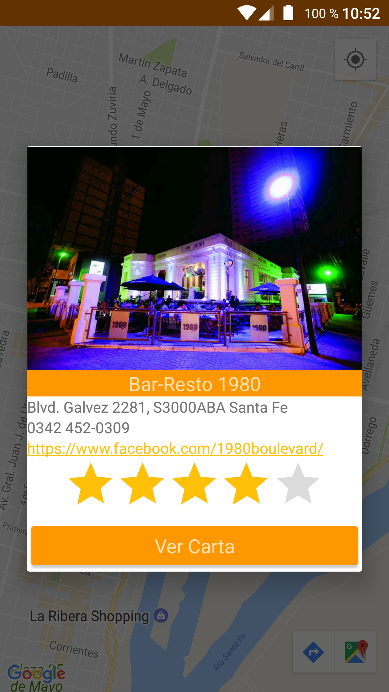

Aplicación Android para el TP final de la materia Desarrollo de Aplicaciones Móviles de la UTN-FRSF.

## Autores

* **Daniel Campodonico** - [DCampodonico](https://github.com/dcampodonico)
* **Emiliano Gioria** - [emigioria](https://github.com/emigioria)
* **Lucas Moretti** - [morettilucas](https://github.com/morettilucas)

Introducción
----------

La aplicación proveerá una alternativa sencilla, intuitiva y flexible a la atención tradicional de
un restaurante, proveyendo a los usuarios de la carta, promociones, ubicaciones y servicios
especiales de los restaurantes adheridos.

Funcionalidades
----------

* Permitir escanear un código QR para la identificación de la mesa de un restaurante
* Presentar la carta del restaurante, permitiéndole al cliente realizar su pedido de forma online
* Mostrar el estado de un pedido: total a pagar, tiempo de entrega, etc
* Notificar el estado de una orden
* Permitir localizar restaurantes cercanos adheridos a la aplicación

Capturas de pantalla
----------
* Pantalla de inicio 
 
* Hacer un pedido 
    
* Ver pedidos realizados 
    
* Ver restaurantes adheridos 
       
